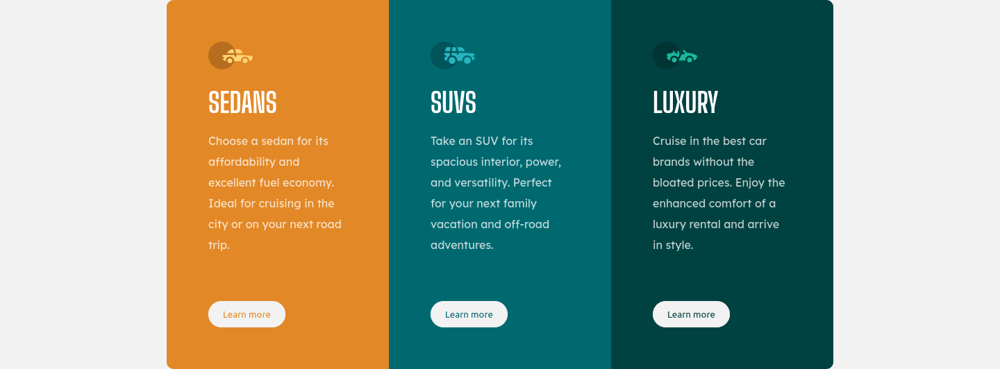
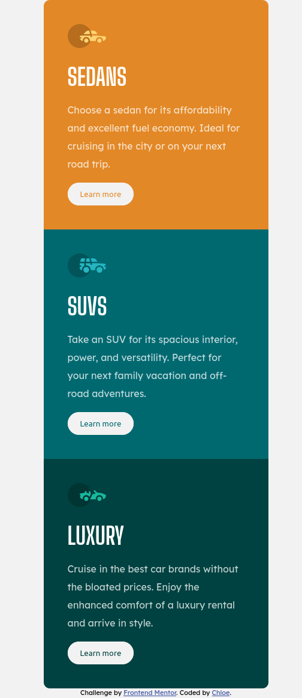

# Frontend Mentor - 3-column preview card component solution

This is a solution to the [3-column preview card component challenge on Frontend Mentor](https://www.frontendmentor.io/challenges/3column-preview-card-component-pH92eAR2-). Frontend Mentor challenges help you improve your coding skills by building realistic projects.

## Table of contents

- [Overview](#overview)
  - [The challenge](#the-challenge)
  - [Screenshot](#screenshot)
  - [Links](#links)
- [My process](#my-process)
  - [Built with](#built-with)
  - [Useful resources](#useful-resources)

## Overview

### The challenge

Users should be able to:

- View the optimal layout depending on their device's screen size
- See hover states for interactive elements

### Screenshot

### Links

- Solution URL: [3-column-preview-card-component-main](https://www.frontendmentor.io/solutions/3-column-preview-card-component-wRi5RqToQ)
- Live Site URL: [3-column-preview-card-component-main](https://frontend-mentor-challenges-rose.vercel.app/3-column-preview-card-component-main/)

## My process

### Built with

- Semantic HTML5 markup
- SCSS
- Flexbox
- Mobile-first workflow

### Useful resources

- [Flexbox on MDN](https://developer.mozilla.org/en-US/docs/Learn/CSS/CSS_layout/Flexbox) - Learn about flexbox

## Author

- Website - [https://www.cgweb.co.uk](https://www.cgweb.co.uk)
- Github - [@cguttweb](https://github.com/cguttweb)
- Frontend Mentor - [cguttweb](https://www.frontendmentor.io/profile/cguttweb)
- Twitter - [@cguttweb](https://www.twitter.com/cguttweb)
