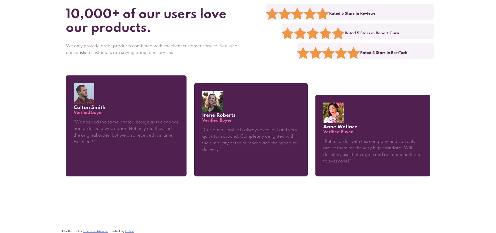

# Frontend Mentor - Social proof section

This is a solution to the [Social proof section challenge on Frontend Mentor](https://www.frontendmentor.io/challenges/social-proof-section-6e0qTv_bA). Frontend Mentor challenges help you improve your coding skills by building realistic projects.

## Table of contents

- [Overview](#overview)
  - [The challenge](#the-challenge)
  - [Screenshot](#screenshot)
  - [Links](#links)
- [My process](#my-process)
  - [Built with](#built-with)

## Overview

### The challenge

Users should be able to:

- View the optimal layout depending on their device's screen size
- See hover states for interactive elements

### Screenshots

### Links

- Solution URL: [Social Proof Section](https://www.frontendmentor.io/solutions/social-proof-section-MtNwwPvWu)
- Live Site URL: [Social Proof Section](https://frontend-mentor-challenges-rose.vercel.app/social-proof-section-master/)

## My process

### Built with

- Mobile-first workflow
- Semantic HTML5 markup
- CSS
  - flexbox
  - grid

## Author

- Website - [https://www.cgweb.co.uk](https://www.cgweb.co.uk)
- Github - [@cguttweb](https://github.com/cguttweb)
- Frontend Mentor - [cguttweb](https://www.frontendmentor.io/profile/cguttweb)
- Twitter - [@cguttweb](https://www.twitter.com/cguttweb)
